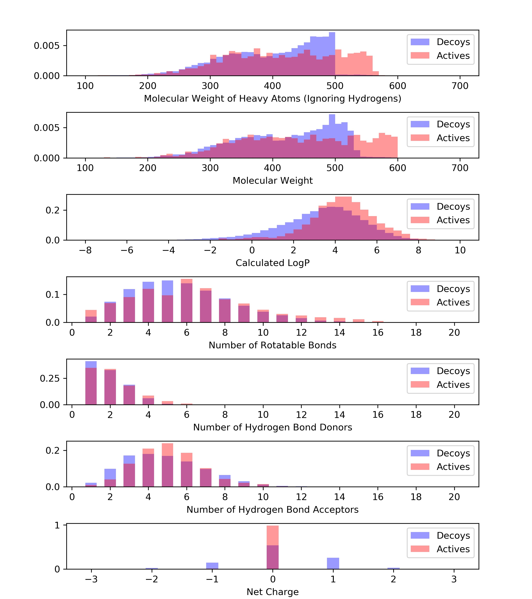
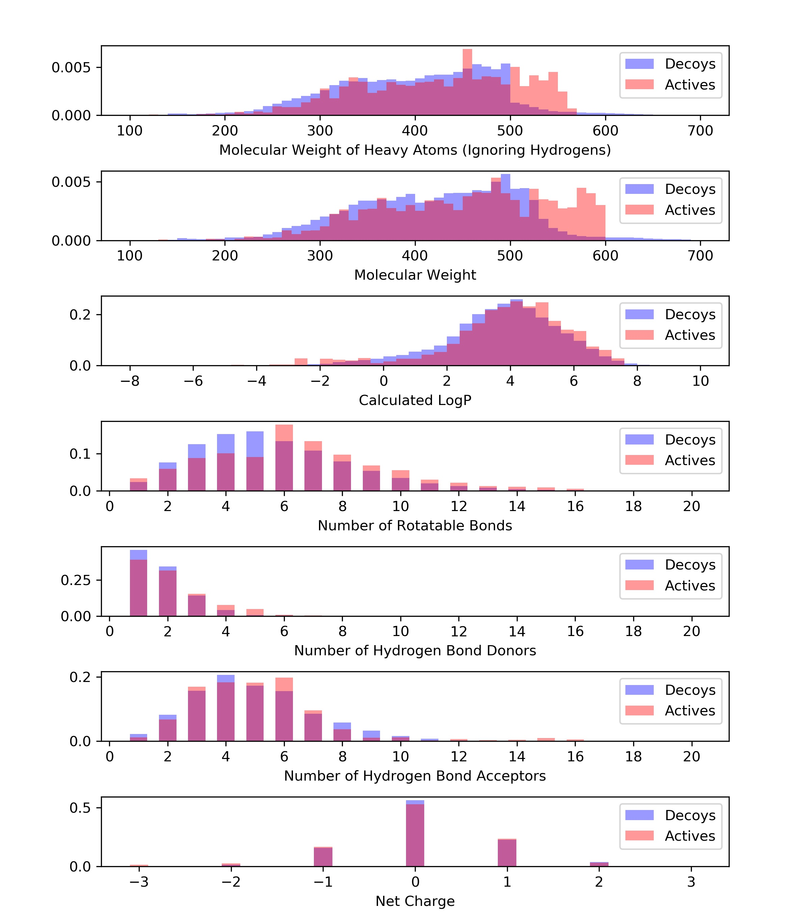

# 1.Download ZINC12 all smiles;
- 1. goto http://zinc12.docking.org/subsets/all-purchasable
- 2. click download button
- 3. click [All](http://zinc12.docking.org/db/bysubset/6/6_p0.smi.gz) under "select Reference (pH 7)"
- 4. download file named "6_p0.smi.gz", 142 MB

# 2. drug-like in ZINC12
```
p.mwt <= 500 and p.mwt >= 150 and p.xlogp <= 5 and p.rb <=7 and p.psa < 150 and p.n_h_donors <= 5 and p.n_h_acceptors <= 10
```

# 3. Download [DUD-E dataset](http://dude.docking.org/)
```bash
  bash 1download_dude.sh
```

# 4. result
## 4.1 performance on DUD-E

| subset         | PROP EF1 | PROP AUC | FP EF1 | FP AUC |
| :------------- | -------: | -------: | -----: | -----: |
| D8_DUDE(ism)   |    21.26 |     0.81 |  10.39 |   0.79 |
| D8_DUDE(sdf)   |     5.57 |     0.59 |   4.79 |   0.73 |
| D8_rebulit     |     4.48 |     0.57 |   4.51 |   0.72 |
| Full(3-fold)*  |    11.66 |     0.66 |  14.57 |   0.85 |
| Full(10-fold)^ |    20.50 |     0.78 |      - |      - |

\* 3-fold is clustering cross target cross validation.

^ 10-fold is random cross target cross validation.

## 4.2 distribution

Should use **.sdf** format in DUD-E for **.ism** lake of charge information.

Diverse use **.ism**, lake of charge information


Diverse use **.sdf**, match better, very less decoys with HeavyAtomMolWt > 500.


Diverse rebuilt, also less decoys with HighAtomMolWt > 500 for ZINC12 has less than 1% of molecules with HighAtomMolWt > 500.


Full DUD-E use **.ism**


Full DUD-E use **.sdf**


## 4.3 remove actives with HeavyAtomMolWt > 500

Removing actives with heavyAtomMolWt > 500 did not remove all bias in properties on DUD-E.

Try stricter decoys generation.

| subset              | option   | PROP EF1 | PROP AUC |
| :------------------ | :------- | -------: | -------: |
| D8_DUDE             | None     |     8.62 |     0.62 |
| D8_DUDE             | rmRandom |     7.98 |     0.62 |
| D8_DUDE             | rmMW>500 |     3.63 |     0.58 |
| D8_rebulit          | None     |     6.26 |     0.56 |
| D8_rebulit          | rmRandom |     5.27 |     0.58 |
| D8_rebulit          | rmMW>500 |     3.61 |     0.54 |
| Full(10-fold)       | None     |    20.86 |     0.73 |
| Full(10-fold)       | rmRandom |    20.22 |     0.72 |
| Full(10-fold)       | rmMW>500 |    15.94 |     0.70 |
| Full(3-fold-random) | rmRandom |    19.25 |     0.71 |
| Full(3-fold-random) | rmMW>500 |    12.70 |     0.67 |
| Full(3-fold-clust)  | rmMW>500 |    13.21 |     0.67 |

## 4.4 Summary:
### 4.4.1 Bias on properties is not only from molecular weight.

| subset        | option   | PROP EF1 | PROP AUC |
| :------------ | :------- | -------: | -------: |
| Full(10-fold) | None     |    20.86 |     0.73 |
| Full(10-fold) | rmRandom |    20.22 |     0.72 |
| Full(10-fold) | rmMW>500 |    15.94 |     0.70 |

`rmMW>500`: remove actives with `HeavyAtomMolWt` > 500 and its decoys.

`rmRandom`: **randomly** remove same number of actives and decoys as `rmMW>500`.

### 4.4.2 Bias not only on properties but also on topology.

| subset       | PROP EF1 | PROP AUC | FP EF1 | FP AUC |
| :----------- | -------: | -------: | -----: | -----: |
| D8_DUDE(sdf) |     5.57 |     0.59 |   4.79 |   0.73 |
| Full(3-fold) |    11.66 |     0.66 |  14.57 |   0.85 |

### 4.4.3 combining `rmMW>500` and `family splitting` can remove the bias on properties.

using [family splitting](2split/crossFamilySplit/family3fold.json)
  - fold1: gpcr(5),nuclear(11),protease(15)
  - fold2: kinase(26)
  - fold3: other(45)

`random-3-fold` is randomly generating 3 folds having same size as `family-3-fold`.

| subset              | option   | PROP EF1 | PROP AUC |
| :------------------ | :------- | -------: | -------: |
| Full(random-3-fold) | None     |    19.07 |     0.70 |
| Full(random-3-fold) | rmRandom |    18.52 |     0.70 |
| Full(random-3-fold) | rmMW>500 |    14.04 |     0.68 |
| Full(family-3-fold) | None     |    12.14 |     0.65 |
| Full(family-3-fold) | rmRandom |    12.09 |     0.64 |
| Full(family-3-fold) | rmMW>500 |     3.95 |     0.60 |