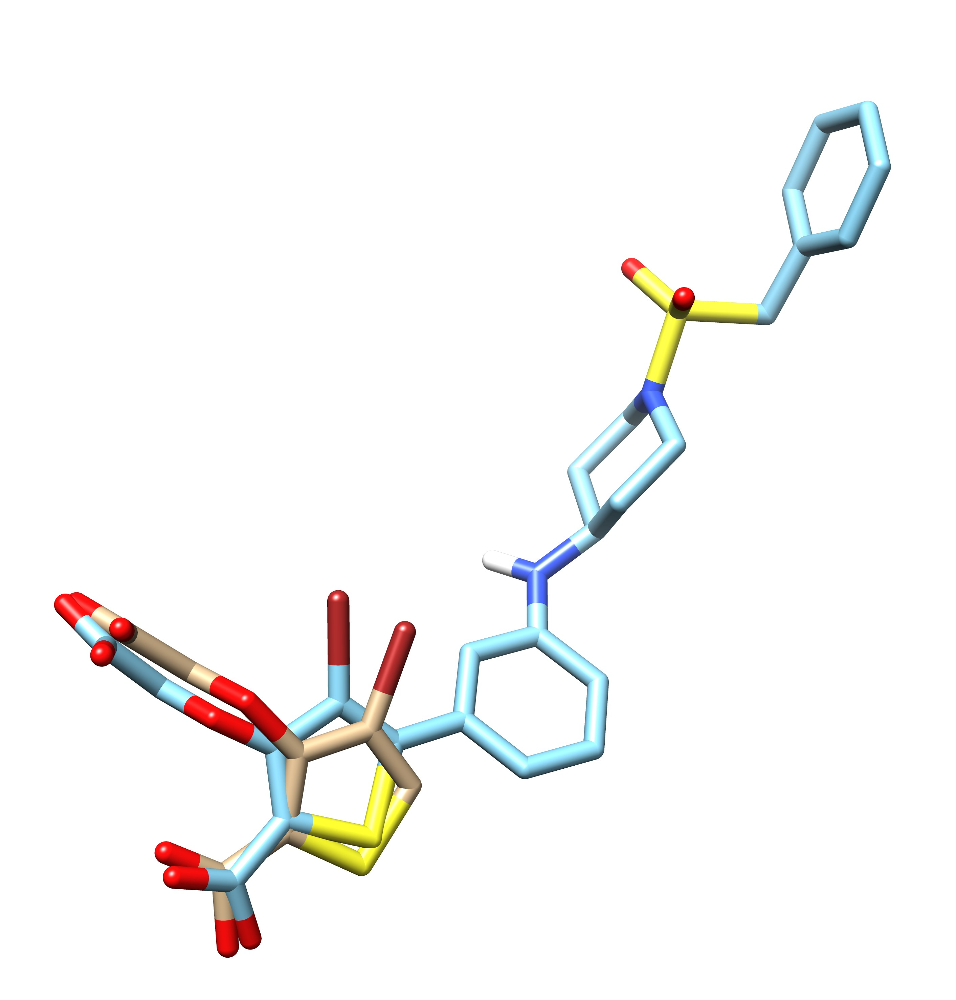
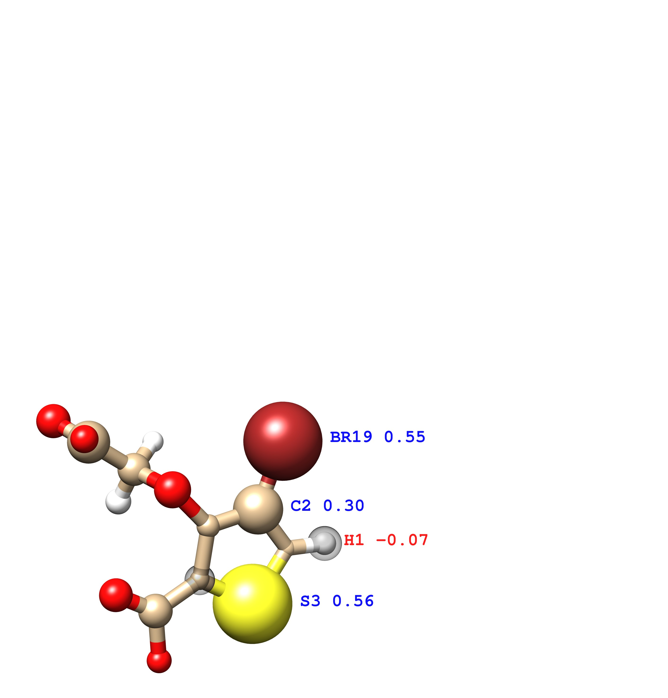
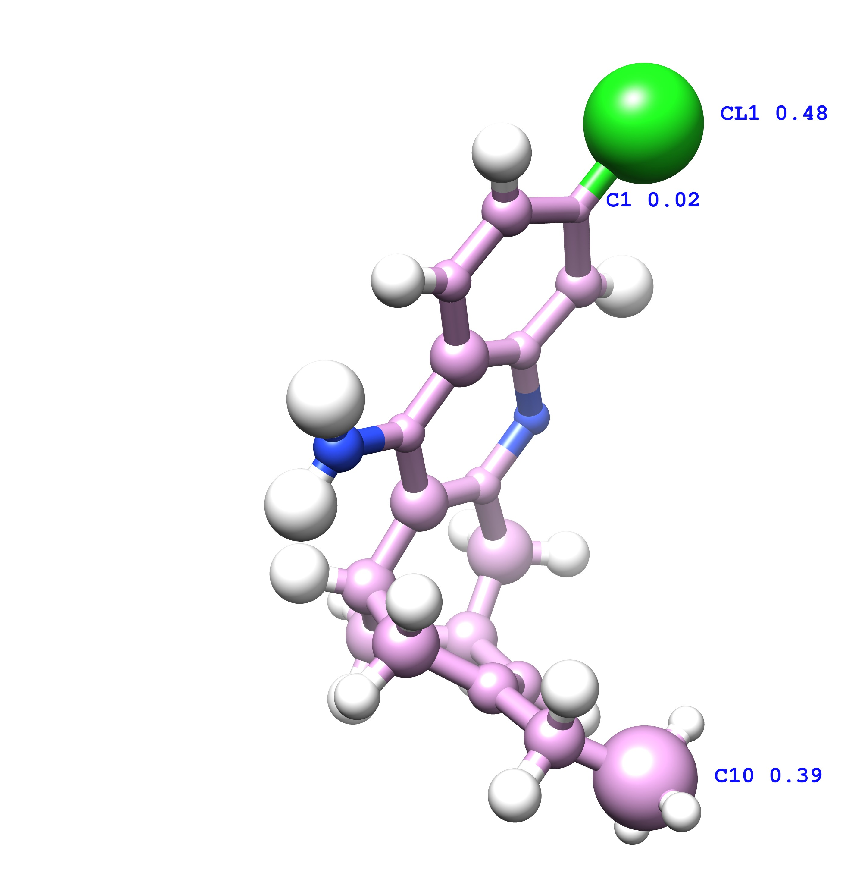

## examples

 | name         | aligned                | ligand1           | ligand2           |
 | ------------ | ---------------------- | ----------------- | ----------------- |
 | structure    |  |  |  |
 | PDB code     |                        | 2hb1              | 2qbp              |
 | pKi/pKd      |                        | 3.80              | 8.40              |
 | pred pKi/pKd |                        | 4.20              | 8.79              |
 | structure    |  |  |  |
 | PDB code     |                        | 1zea              | 2pcp              |
 | pKi/pKd      |                        | 5.22              | 8.7               |
 | pred pKi/pKd |                        | 5.66              | 7.60              |
 | structure    |  |  |  |
 | PDB code     |                        | 1gpk              | 1e66              |
 | pKi/pKd      |                        | 5.37              | 9.89              |
 | pred pKi/pKd |                        | 6.00              | 8.12              |

