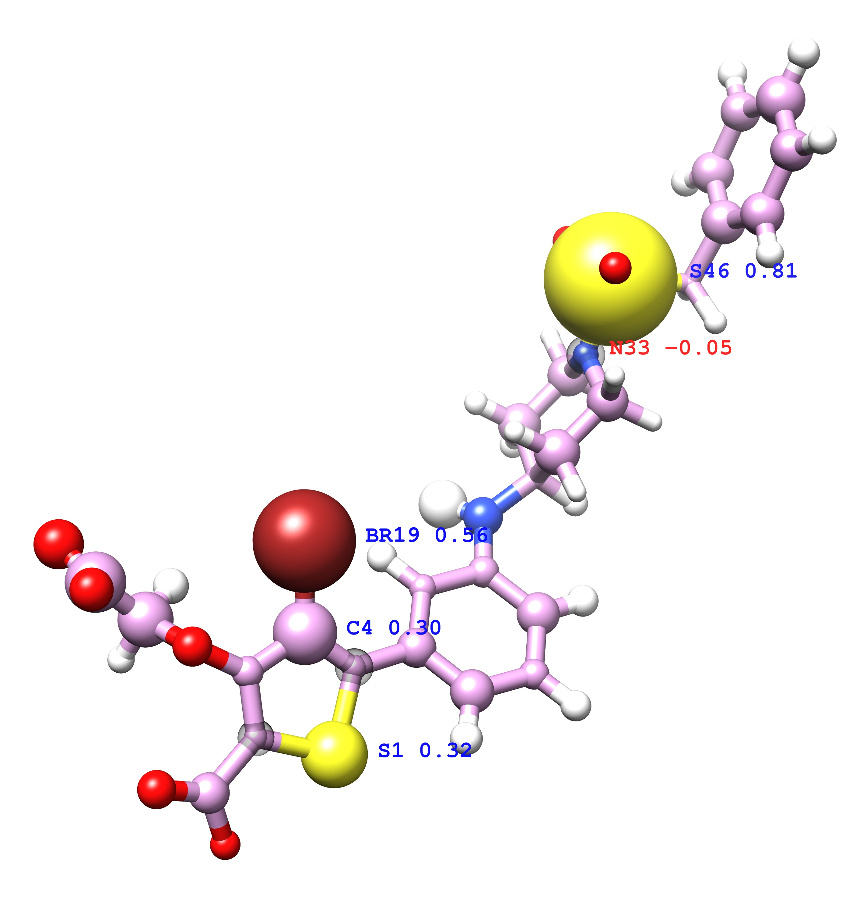
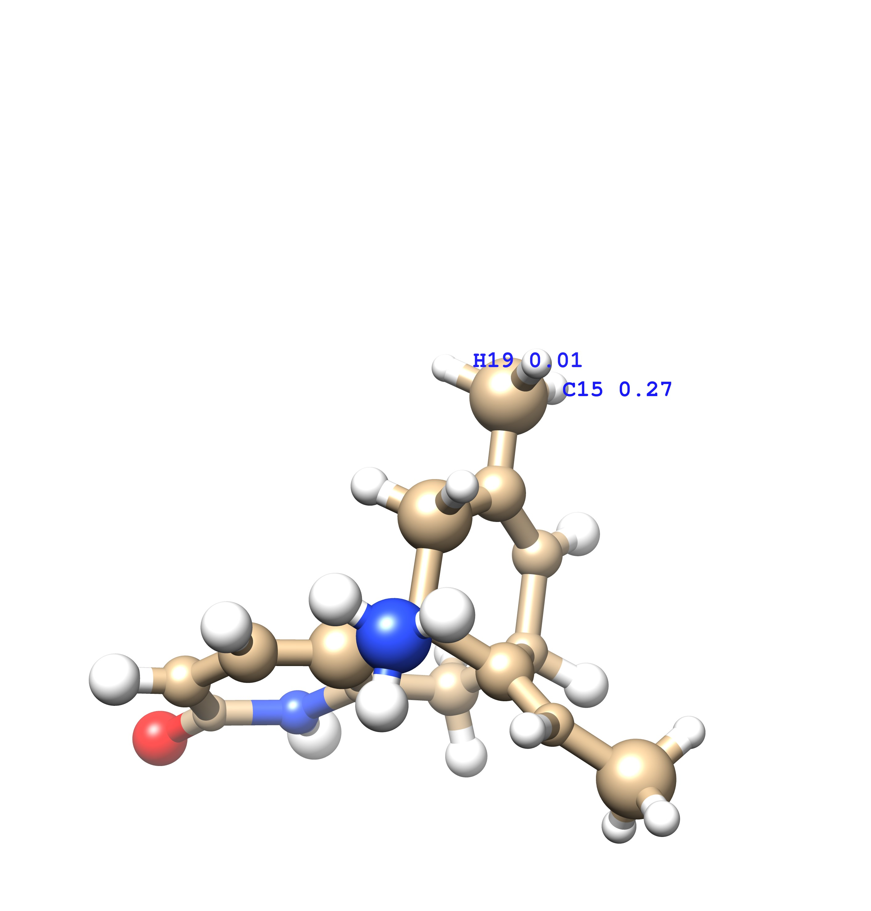

## Visualization of atomic pKi/pKd contribution
1. Assign the [atomic pKi/pKd contribution](https://github.com/hnlab/deepchem/commit/468bc580f9dbea7cf6762832cc4d91c77089aec3) to occupancy in .pdb format.
2. Align the ligands having same target by protein alignment. [align_lig.py](./align_lig.py)
3. Set atom radius based on the occupancy by chimera commands generate by python scripts. [occ_view.py](./occ_view.py)
4. Read [index](index/INDEX_core_cluster.2013.clust) of PDB core set and perform step 2 and 3 on each cluster. [python gen_clust_view.py](./python_gen_clust_view.py)
5. Open chimera seesion and pick them by hand, final chimera seesion saved in [chimera-seesions](./chimera_sessions)
6. Figures with/without labels saved in [jpg](./jpg), labels need more work.

 |      name      |        aligned         |      ligand1      |      ligand2      |
 | :------------: | :--------------------: | :---------------: | :---------------: |
 |   structure    |  |  |  |
 | pKi/pKd (pred) |       2hb1-2qbp        | 2hb1: 3.80 (4.20) | 2qbp: 8.40 (8.79) |
 |   structure    |  |  |  |
 | pKi/pKd (pred) |       1zea-2pcp        | 1zea: 5.22 (5.66) | 2pcp: 8.7 (7.60)  |
 |   structure    |  |  |  |
 | pKi/pKd (pred) |       1gpk-1e66        | 1gpk: 5.37 (6.00) | 1e66: 9.89 (8.12) |

